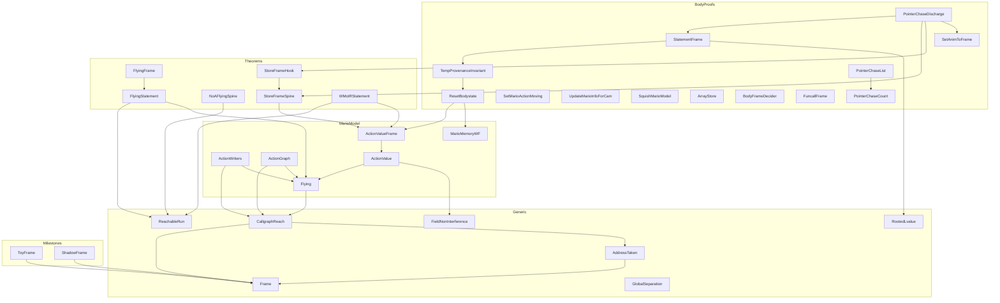

# `proofs/` — structure & dependency graph

Hand-written Rocq: generic analyses over the generated Clight ASTs, plus the
theorems. Files are grouped into **6 layered subdirectories** that mirror the
`Require` dependency DAG — the directory order below *is* the build/topological
order (a file only ever depends on files in its own layer or an earlier one).

All cross-file imports use `From SM64.Proofs Require Import <Basename>`, which
resolves by unique basename regardless of subdirectory — so moving a file
between layers needs no edit to its importers, only to `_CoqProject`.

> Renaming history: many files/theorems were renamed to literal names on
> 2026-06-01. Older `docs/` notes use the previous names — see
> [`../docs/RENAMING.md`](../docs/RENAMING.md) for the full old → new map.

---

## Layer 1 — `Generic/` — subject-independent analyses + semantic frame lemmas

Reusable infrastructure: nothing here mentions Mario. Depends only on CompCert
(and, for two files, a generated AST used purely as a vehicle).

| File | What it does |
|---|---|
| `Frame.v` | generic *syntactic* frame analysis: does a function assign to a given global? (`writes_global`) |
| `AddressTaken.v` | syntactic "address-taken" / escape analysis over the AST |
| `CallgraphReach.v` | whole-program "formal grep + callgraph" reachability skeleton |
| `RootedLvalue.v` | a store rooted at temp `p` lands in `p`'s block (general lvalue rooting) |
| `ReachableRun.v` | temporal scaffolding: reachable runs + the abstract `noA_run ⇒ not flying` harness |
| `FieldNonInterference.v` | the *semantic* frame lemma: a store to struct field f1 leaves a different field f2 unchanged (over any composite) |
| `GlobalSeparation.v` | the separation / "havoc" rung: a store to a different global preserves the first (block distinctness) |

## Layer 2 — `Milestones/` — pipeline demos (not load-bearing for the theorem)

| File | What it does |
|---|---|
| `ToyFrame.v` | M0: the generate → load → compute → check spine on a toy C file |
| `ToyReach.v` | the semantic kernel of the closed-world / entrypoint argument |
| `ShadowFrame.v` | M1: the same generic syntactic analysis, on a real SM64 translation unit |
| `ShadowSpec.v` | a real-world functional-correctness theorem about an actual shadow function |

## Layer 3 — `MarioModel/` — Mario memory, action vocabulary, value engine

| File | What it does |
|---|---|
| `MarioMemoryWF.v` | well-formed Mario memory: the static globals occupy distinct blocks |
| `Flying.v` | R1 "you must press A to fly": `ACT_FLYING` constants, the flying setters, the action writers |
| `ActionWriters.v` | whole-(game-)program enumeration of `MarioState.action` writers |
| `ActionGraph.v` | extracts the action *transition graph* from the real handler bodies |
| `ActionValue.v` | value-level reasoning about the action field (e.g. `set_mario_action` returns its argument) |
| `ActionValueFrame.v` | the value-aware frame *engine* (`exec_stmt_value_preserves`) |

## Layer 4 — `BodyProofs/` — per-handler preservation proofs + the frame engine

The "scoreboard": each handler body is shown to preserve the non-flying action
invariant, plus the generic engine that discharges them.

| File | What it does |
|---|---|
| `ResetBodystate.v` | the first real action-body preservation proof |
| `SetAnimToFrame.v` | per-handler proof: `set_mario_animation` helper |
| `SetMarioActionMoving.v` | per-handler proof: `set_mario_action_moving` |
| `UpdateMarioInfoForCam.v` | per-handler proof: `update_mario_info_for_cam` |
| `SquishMarioModel.v` | per-handler proof: `squish_mario_model` |
| `ArrayStore.v` | the array-element store inverter (the last un-cracked lvalue shape) |
| `BodyFrameDecider.v` | a *decidable* per-body frame check + its soundness |
| `FuncallFrame.v` | the generic engine → funcall bridge (the `forall f` lemma) |
| `TempProvenanceInvariant.v` | the capstone temp-provenance engine, built incrementally |
| `StatementFrame.v` | the statement-level bundle frame (the assembly) |
| `PointerChaseCount.v` | measures the per-function pointer-chase proof burden |
| `PointerChaseList.v` | the generated-then-verified named enumeration of chase functions |
| `PointerChaseDischarge.v` | ties the engine to the named handlers |

## Layer 5 — `Theorems/` — assembled top-level statements (the spine)

| File | What it does |
|---|---|
| `FlyingStatement.v` | the high-level "you must press A to fly" theorem, stated |
| `FlyingFrame.v` | wires the interprocedural rung into the flying invariant's step obligation |
| `NoAFlyingSpine.v` | the middle layer of "no A ⇒ no flying" |
| `StoreFrameSpine.v` | the store-frame side of "no A ⇒ no fly" |
| `StoreFrameHook.v` | wires the chase engine into the spine's funcall-level target |
| `WMotRStatement.v` | the capstone: tethers "no A ⇒ no flying" to real terms |

## Layer 6 — `Spikes/` — de-risking experiments

| File | What it does |
|---|---|
| `SymbolicLinking.v` | symbolic-linking spike (OOM-free cross-translation-unit calls) |

---

## Dependency graph (proof → proof edges)



The complete edge list (authoritative) is the set of `From SM64.Proofs Require
Import …` lines; regenerate a textual view with:

```sh
for f in $(find proofs -name '*.v' | sort); do
  echo "$(basename "$f" .v) <- $(grep -hE '^\s*From SM64.Proofs Require' "$f" \
    | sed -E 's/.*Require (Import )?//; s/\.\s*$//')"
done
```
